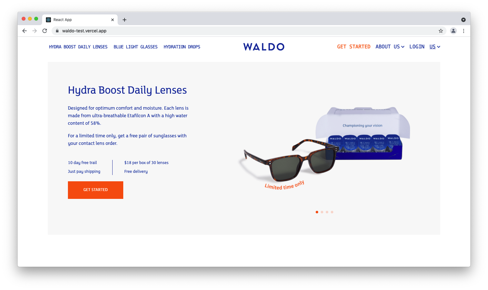
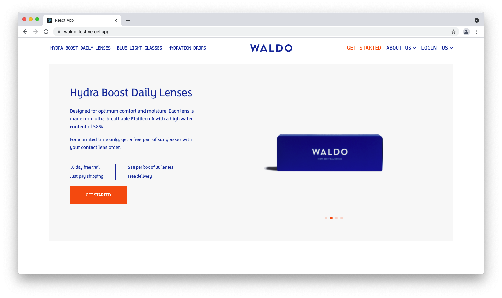
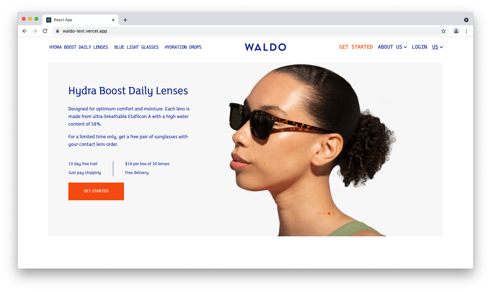
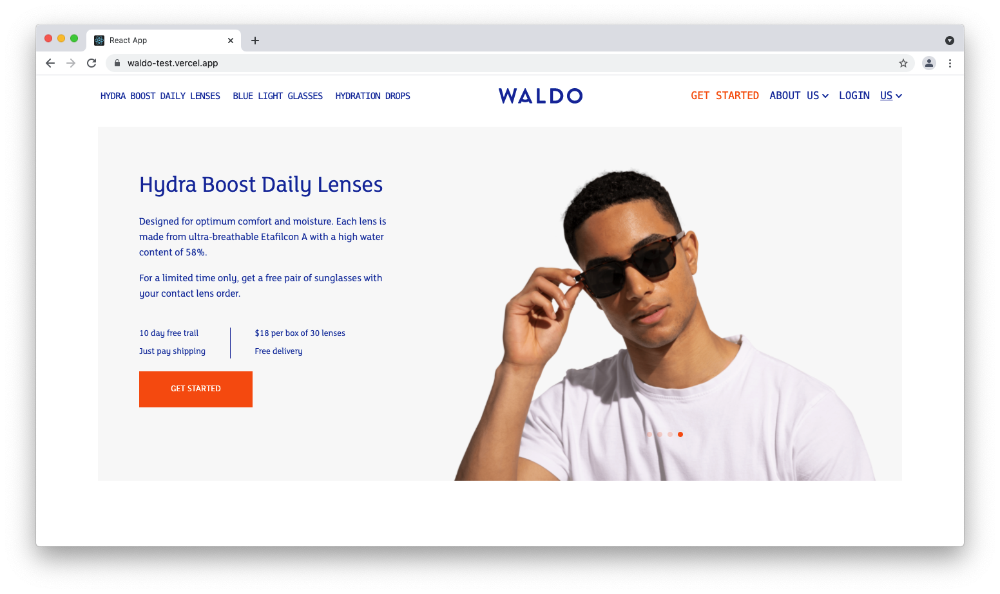
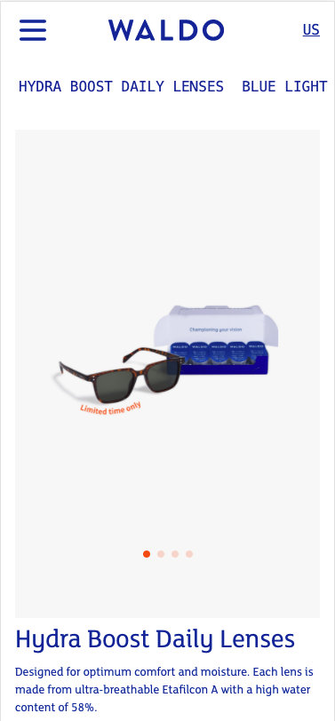

# WALDO Test

This is a submission for my [WALDO Test](https://waldo-test.vercel.app/) I was given the task of recreating a design from XD using React and Tailwindcss. 

## Table of contents

- [Overview](#overview)
  - [The test](#the-test)
  - [Screenshot](#screenshot)
  - [Links](#links)
- [My process](#my-process)
  - [Built with](#built-with)
  - [What I learned](#what-i-learned)
  - [Continued development](#continued-development)
  - [Useful resources](#useful-resources)
- [Author](#author)

## Overview

### The test

When finished the app should:

- View the optimal layout for the site depending on their device's screen size
- Include all assests presented in the design

### Screenshot

### Links

- Test Solution Github URL: [Test Solution Github URL](https://github.com/EugeneCarbado/waldo_test)
- Live Site URL: [Live site for my solution URL](https://waldo-test.vercel.app/)

## My process

For my process I was teasked to use React and Tawilwindcss. For the carousel I used a node package called Swiperjs. This is a fully customisable carousel package that can be instantly added to any React project easily. The Test also included a mobile first approach. I also used .map() to filter through an object of the images and their respective alt's and classes.

### Built with

- React
- Tailwindcss
- SVG's
- Mobile-first workflow
- SwiperJs
- Javascript

### What I learned

It was my first time using Tailwindcss and it was a very interesting process. Mixing it with React seemed a bit confusing at first but with a steady workflow I was soon able to achieve as close to the results I desired. The documentation is very easy to follow and there are numerous videos for more in depth know how.

### Continued development

It would certainly be a good weapon in my arsenal to use Tailwind. I would like to use more features for animations and UI interactivity.

### Useful resources

- [Getting started with Tailwind CSS](https://tailwindcss.com/docs) - Documents are the first place I look when I would like to use a new framework.
- [Make a React Website with Tailwind CSS Tutorial](https://www.youtube.com/watch?v=gOQ31Kc8H5E&t=1102s) - I used this video by Brian Design to help me get the basics of how to implement Tailwind with React.
